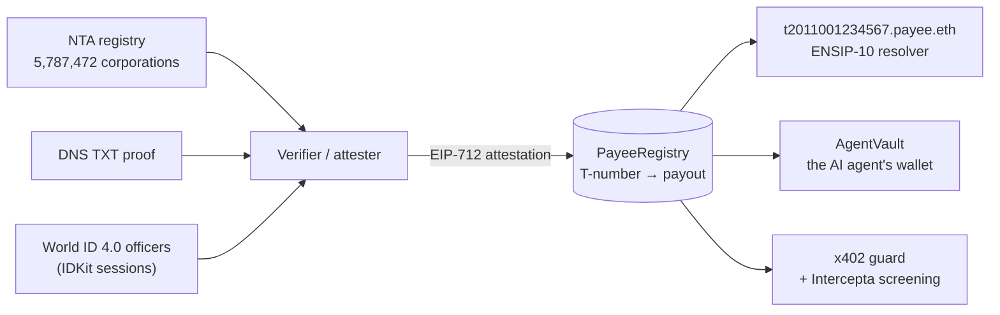

# Meigi (名義)

**Confirmation of Payee for stablecoins and AI agents. Pay companies, not addresses.**

- **Live:** [meigi.karanbishttt.workers.dev](https://meigi.karanbishttt.workers.dev) is the landing page, and
  [meigi-app.karanbishttt.workers.dev](https://meigi-app.karanbishttt.workers.dev) is the app. The registry
  explorer, ENS check and event feed read Sepolia live. Steps that need our services show recorded real
  runs.
- **Team:** Karan Singh Bisht & Adithya Prasanna Suriya Prakash.
- **Event:** ETHGlobal Tokyo 2026, From Scratch track.

A stablecoin payment goes to an address, and nothing checks that the address belongs to the company you mean
to pay. Three attacks all end the same way, with the money redirected:
- a fake "our bank details changed" email;
- a prompt injection hidden in an invoice;
- a hacked x402 server that swaps `payTo`.

Banks fixed this for wires with Confirmation of Payee. Stablecoins, and the AI agents now paying with them,
have nothing like it.

Every Japanese company that issues qualified invoices prints a public, government-issued **T-number** on
them. Japan comes first, but the design is global: any official business identifier works the same way, and the
verifier already checks the global **LEI**. Meigi binds a T-number to **one payout address**:
- **registered** only after an exact match against the National Tax Agency's corporate registry, a DNS proof,
  and World ID officers;
- **changed** only with the business key plus the same verified humans, after **72 hours in public**, where it
  can be cancelled;
- **enforced** on-chain when money moves.



**"This is our AI accountant. It holds JPYC and pays our suppliers. Please try to rob it."** Write it a fake
invoice or a bank-change email, or hide a prompt injection. Its LLM may well agree to pay the scammer. Then
the vault reverts `PayeeMismatch` and names the real company.

## Try it without installing anything

- **The landing page** reads the registry live: https://meigi.karanbishttt.workers.dev → "Resolve a T-number" →
  `T2011001234567`.
- **The registry explorer** shows the live payee, its ENS name and the event feed:
  https://meigi-app.karanbishttt.workers.dev/registry/T2011001234567.
- **ENS, from any client.** `t2011001234567.payee.eth` resolves on Sepolia with stock viem and no
  configuration:
  ```sh
  (cd apps/landing && RPC_URL=https://ethereum-sepolia-rpc.publicnode.com node --input-type=module) < contracts/script/ens/check-viem.mjs
  # {"address":"0x9B4fc8994FcF2d5FE08a82A9454B61AA14D647e4","legalName":"株式会社メイギ商事","status":"active",…}
  ```
- **x402:** an honest purchase settled on Sepolia in
  [`0xf3c29896…77b0df`](https://sepolia.etherscan.io/tx/0xf3c298960b9abac5466f4aa6e59f9a9ba4b73de703df3468d72f18049077b0df).
  The same merchant with a swapped `payTo` is refused before anything is signed.

## How each piece works

| Piece | What it guarantees | Code |
|---|---|---|
| **PayeeRegistry** | T-number → one payout. A second claim freezes the number (dispute); it is never overwritten. Payout changes need the business key **and** an officer quorum, then wait 72h in public. The controller, attester or governance can cancel them. | [`contracts/src/registry`](contracts/src/registry) |
| **PayeeResolver** (ENS) | `t<13 digits>.payee.eth` resolves to the active payout only. Unknown or disputed numbers resolve to nothing, and a queued change never resolves early. | [`contracts/src/ens`](contracts/src/ens) |
| **AgentVault** | The agent's key can only pay owner-approved vendors, within caps, to the payout the owner pinned, which must still be the registry's. A swapped address reverts `PayeeMismatch`; a registry change reverts `VendorPayoutChanged`. | [`contracts/src/payments`](contracts/src/payments) |
| **Verifier** | Exact match against the NTA bulk data after NFKC normalisation. Keybase-style DNS proof. World ID 4.0 officer sessions. Approvals whose World ID signal pins the exact change. **Global:** `GET /lei/:lei` verifies any company's LEI against GLEIF and links Japanese ones to their T-number. For example, Sony Group's LEI links to `T5010401067252`. | [`services/verifier`](services/verifier) |
| **AP agent** | Invoice → deterministic extraction → System-1 triage (our fine-tuned model) → deterministic kernel → Intercepta screening → pay or hold. Only the kernel can move money; the LLM only explains. | [`services/agent`](services/agent) |
| **x402 guard** | Before an agent signs an x402 payment: a declared T-number must match `payTo`. Merchants that declare none get small amounts only, after a clean Intercepta screen. | [`packages/x402-guard`](packages/x402-guard), [`services/x402-demo`](services/x402-demo) |
| **PayeeBench-JA** | A Japanese-first benchmark for triaging payment redirection. Kev-0.8B, fine-tuned on a MacBook, scores 0.918 accuracy. That beats the released Kev-4B (0.795) and Llama 3.3 70B (0.815), with ECE 0.024, at 39 ms. | [`bench`](bench) |
| **Web app / landing** | Registry explorer with a live event feed, registration, officer approvals, agent console and x402 demo; a three.js "Sakasa Fuji" landing page. | [`apps/web`](apps/web), [`apps/landing`](apps/landing) |

## Sponsor integrations

- **ENS (ENSv2, Sepolia).** `payee.eth` is registered on both Sepolia ENSv2 deployments with
  [`PayeeResolver`](contracts/src/ens/PayeeResolver.sol) as its resolver and no subregistry. The resolver
  implements ENSIP-10 `resolve(name, data)` and answers from the registry at call time, so millions of
  T-numbers resolve without minting a single subname. Registration scripts:
  [`contracts/script/ens`](contracts/script/ens).
  - The AP agent has its own namespace, `ap.meigi.eth` (ENSv2 subregistry plus a PermissionedResolver).
  - It carries the ENSIP-26 agent records.
  - Its key can edit only `agent-status` (Enhanced Access Control).
- **World ID (IDKit 4.0).**
  - An officer enrolls once with an IDKit session.
  - A payout change needs `proveSession` from the same human, with a signal that binds chain, registry,
    T-number, action, target, nonce and deadline.
  - The proof is verified server-side, then turned into an EIP-712 approval the contract checks.
  - Code: [`services/verifier/src/world/session.ts`](services/verifier/src/world/session.ts),
    [`services/verifier/src/routes/intents.ts`](services/verifier/src/routes/intents.ts),
    [`apps/web/src/ui/world`](apps/web/src/ui/world),
    [`contracts/src/registry/OfficerQuorum.sol`](contracts/src/registry/OfficerQuorum.sol).
- **Intercepta.** The quick-scan runs before signing.
  - Code: [`packages/x402-guard/src/intercepta.ts`](packages/x402-guard/src/intercepta.ts) (the call);
    `checkPayee` and `checkUndeclared` in [`check.ts`](packages/x402-guard/src/check.ts) (the decisions);
    `services/agent/src/screening` (the AP agent).

## Deployed on Sepolia (all [Sourcify](https://sourcify.dev) exact matches)

| Contract | Address |
|---|---|
| PayeeRegistry | [`0x205c977cF1f4Ed42e51a48759550eF40160A6396`](https://repo.sourcify.dev/11155111/0x205c977cF1f4Ed42e51a48759550eF40160A6396) |
| PayeeResolver (`payee.eth`) | [`0x096ebC07eE87fbb19FF920a5c81b2Ad5c9104A1e`](https://repo.sourcify.dev/11155111/0x096ebC07eE87fbb19FF920a5c81b2Ad5c9104A1e) |
| AgentVault | [`0x87A798CD92dE1340B1b761dd45196AC82bEF793B`](https://repo.sourcify.dev/11155111/0x87A798CD92dE1340B1b761dd45196AC82bEF793B) |
| PayRouter | [`0xbA95BA5D4a2244cce46a76920f411B225116850C`](https://repo.sourcify.dev/11155111/0xbA95BA5D4a2244cce46a76920f411B225116850C) |
| MockJPYC (`mJPYC`) | [`0xEcA2B093682a46B14b143474d188A120bA2d0EC2`](https://repo.sourcify.dev/11155111/0xEcA2B093682a46B14b143474d188A120bA2d0EC2) |

Demo payees are fictional companies, marked as fictional in their on-chain evidence:
- `T2011001234567` 株式会社メイギ商事, the AP agent's supplier;
- `T8999900000001` 株式会社フジデータ, the x402 merchant.

Both were checked against the nationwide NTA data. See [`docs/runbook.md`](docs/runbook.md).

## Security

The contracts went through three review rounds by separate AI reviewers, with proof-of-concept exploits:
- 16 findings: 14 fixed, 2 documented as by design;
- round 3 mutation-tested every fix;
- 95 Foundry tests, including fuzzing of the core guarantee.

Roles, delays and the trust model are in [`contracts/README.md`](contracts/README.md). The agent is untrusted
by design: its worst case is overpaying an approved vendor, up to that vendor's caps.

## Run it locally

Needs Node ≥ 22, pnpm 11 and Foundry. The bench also needs Python with uv. Secrets live in a git-ignored
`.env` at the repo root; each package README lists the variables it reads.

```sh
pnpm install
cd contracts && forge test && cd ..                    # 95 tests
pnpm --filter @meigi/verifier start                    # :8787 (needs the NTA index: services/verifier/scripts/build_nta_index.py)
pnpm --filter @meigi/agent start                       # :8788
pnpm --filter @meigi/x402-demo start                   # :8790
pnpm --filter @meigi/web dev                           # :5173
pnpm dev:landing
```

Service ports, re-seeding and demo checks: [`docs/runbook.md`](docs/runbook.md). Public deploy:
[`scripts/deploy-demo.sh`](scripts/deploy-demo.sh).

## Docs

- [`docs/spec.md`](docs/spec.md): product and architecture.
- [`docs/runbook.md`](docs/runbook.md): live addresses, services, governance rules.
- [`docs/world-agents-spec.md`](docs/world-agents-spec.md): human approval of held agent payments.
- [`AI_USAGE.md`](AI_USAGE.md) and [`docs/ai`](docs/ai): how AI was used, with every sub-agent brief.

MIT licensed.
